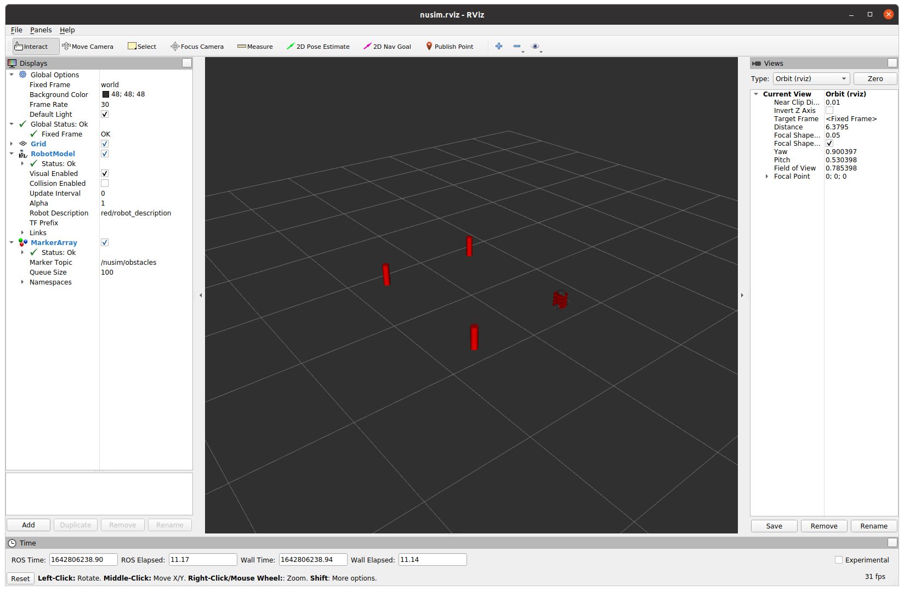

# Nusim
A basic RViz simulator for a turtlebot in an environment with obstacles.

## To launch the simulator:
* `roslaunch nusim nusim.launch` to see a red turtlebot in rviz, with 3 cylindrical obstacles in its vicinity.

## To edit parameters of the simulator:
* `config/basic_world.yaml` contains information specifying the robot's starting location, and the obstacles' x coordinate, y coordinate, and radius. An arbitrary amount of obstacles can be added.

## Other functionality in the simulator:
* `rosservice call /nusim/reset` to reset the turtlebot back to its starting location.
* `rosservice call /nusim/teleport` to teleport the turtlebot to a user-specified x, y, and theta orientation.

