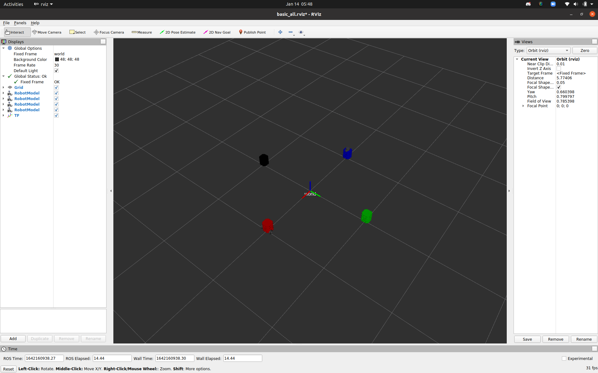

# Nuturtle Description
URDF files for Nuturtle James
* `<roslaunch nuturtle_description load.launch>` to see the robot in rviz.
* `<roslaunch nuturtle_description load_all.launch>` to see four copies of the robot in rviz.
